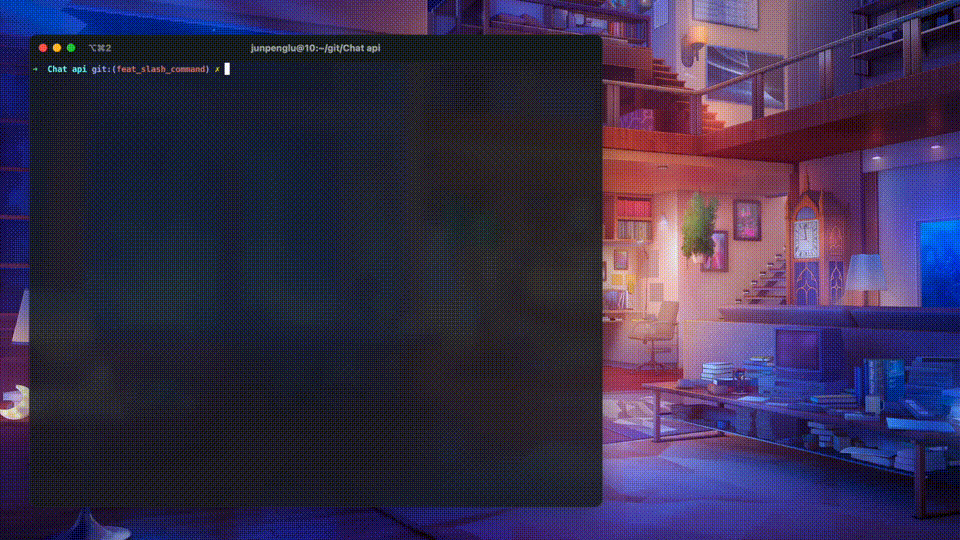
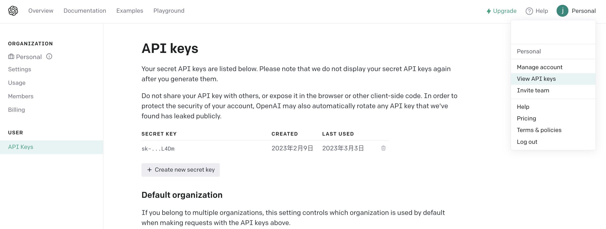

## 在终端与GPT聊天

[](./README.md)
[](./README.zh-CN.md)
[]()
[](https://github.com/RichardLitt/standard-readme)

本项目实现在终端与 ChatGPT 聊天

回答中的 Markdown 内容渲染为富文本的精美格式

支持上键历史检索、可选的多行提问、tokens 统计

聊天框中支持斜杠(/)命令，可实时切换多行提问模式、撤销上一次提问和回答、修改system prompt等，具体请查看下面的可用命令

支持将聊天消息保存到 JSON 文件中，并能够从文件中加载

> 注意，终端需能正常访问外网（配置代理的环境变量）才能运行代码，如系统已开启代理但没有配置终端代理，API 请求就会从国内 IP 发起，可能导致账号停用 ([#2](https://github.com/xiaoxx970/chatgpt-in-terminal/issues/2))



默认使用 [gpt-3.5-turbo](https://platform.openai.com/docs/guides/chat/chat-completions-beta) 模型，也就是 ChatGPT(免费版) 所使用的模型。

## 安装

1. 克隆 Repo 并进入目录

   ```shell
   git clone https://github.com/xiaoxx970/chatgpt-in-terminal.git
   cd ./chatgpt-in-terminal
   ```

2. 在项目根目录下创建 `.env` 文件并写入 OPENAI_API_KEY 变量，内容如下

   ```shell
   OPENAI_API_KEY=你的API_KEY
   ```

   OpenAI 的密钥可在主页右上角点击 `View API keys` 打开的页面中生成，直达链接：https://platform.openai.com/account/api-keys

   

   > 如果不配置 `.env` 文件，也可在运行时直接输入API KEY，单次生效

3. 通过 requirements.txt 安装依赖

   ```shell
   pip3 install -r requirements.txt
   ```

## 更新

如果要把脚本更新为最新版本，在本项目目录下运行：

```sh
git pull
pip3 install -r requirements.txt
```

> 如果 git 命令报错
>
> ```shell
> error: Your local changes to the following files would be overwritten by merge:
>         .env
> Please commit your changes or stash them before you merge.
> Aborting
> ```
>
> 就先从 git 取消跟踪 .env 文件（不会删除本地 .env）
>
> ```sh
> git rm --cache .env
> ```
>
> 再运行上面 `git pull` 命令即可

## 如何使用

使用以下命令运行：

```shell
python3 chat.py
```

>  原始格式的对话记录会存至 `chat.log`

### 可用参数

| 选项          | 功能                              | 示例                                          |
| ------------- | --------------------------------- | --------------------------------------------- |
| -h, --help    | 显示此帮助信息并退出              | `chat.py --help`                              |
| --load FILE   | 从文件中加载聊天记录              | `chat.py --load chat_history_code_check.json` |
| --key API_KEY | 选择 .env 文件中要使用的 API 密钥 | `chat.py --key OPENAI_API_KEY1`               |
| --model MODEL | 选择要使用的 AI 模型              | `chat.py --model gpt-3.5-turbo`               |
| -m, --multi   | 启用多行模式                      | `chat.py --multi`                             |
| -r, --raw     | 启用原始模式                      | `chat.py --raw`                               |

> 多行模式与 raw 模式可以同时使用

### `.env` 配置文件

```.env
# OpenAI 的 API 密钥
OPENAI_API_KEY=
# 向 API 请求的最大等待时间，默认30s
OPENAI_API_TIMEOUT=30
# 是否为对话自动生成标题，默认开启（生成标题将额外消耗少量 token）
AUTO_GENERATE_TITLE=1
```

### 可用命令

- `/raw`：在回复中显示原始文本，而不是渲染后的 Markdown 格式

  > 切换后可使用 `/last` 命令重新打印当前回复

- `/multi`：启用或禁用多行模式，允许用户输入多行文本

  > 多行模式下使用 [[Esc]] + [[Enter]] 提交问题
  >
  > 如果是粘贴多行文本，则单行模式也可以正常粘贴

- `/stream`：禁用或启用流式传输

  > 在流式传输模式下，回复将在客户端收到第一部分回应后开始逐字输出，减少等待时间。流式传输默认为开启。

- `/tokens`：显示已花费的 API token 数统计和本次对话的 token 长度

  > GPT-3.5的对话token限制为4096，可通过此命令实时查看是否接近限制

- `/usage`：~~显示已用的 API 的账号余额~~ 暂时不可用

- `/model`：显示或选择使用的模型

  > 默认支持 `gpt-4`，`gpt-4-32k`，`gpt-3.5-turbo`，其余的模型需要在代码内更改 API endpoint

- `/last`：显示最后一条回复

- `/copy` 或 `/copy all`：将最后一条回复内容复制至剪切板

  - `/copy code [index]`：将最后一条回复内容中的第 `index` 块代码复制至剪切板

    > 如果不指定 `index`，则终端会打印所有代码块并询问要复制的序号

- `/delete` 或 `/delete first`：将当前会话第一条提问和回答内容删除

    > 在会话 token 将要达到上限时会提示用户，已经超出上限时会询问是否删除第一条信息

  - `/delete all`：将所有会话删除

- `/save [filename_or_path]`：将聊天记录保存到指定的 JSON 文件中

  > 如果未提供文件名或路径，客户端将生成一个，如果生成失败，则在输入时建议使用文件名 `chat_history_年-月-日_时,分,秒.json`

- `/system [new_prompt]`：修改系统提示语

- `/title [new_title]`: 为这个聊天终端设置标题

   > 如果没有提供 new_title，将根据第一个提问生成新标题

- `/timeout [new_timeout]`：修改 API 超时时间

  > 超时默认30s，也可通过 `.env` 文件中的 `OPENAI_API_TIMEOUT=` 配置默认超时

- `/undo`：删除上一个问题和回答

- `/help`：显示可用命令

- `/exit`：退出应用

### 退出词

在聊天中，使用退出词可以结束本次会话，退出词有：

```py
['再见', 'bye', 'goodbye', '结束', 'end', '退出', 'exit', 'quit']
```

退出词将作为一个问题发送给 ChatGPT，在 GPT 回答后退出。

也可使用 `Ctrl-D` 或 `/exit` 立即退出

退出后将显示本次聊天所使用的 tokens 统计

> 目前价格为: $0.002 / 1K tokens，免费版速率限制为: 20次 / min (`gpt-3.5-turbo`)

## Changelog

### 2023-04-13

- 增加后台生成并设置终端标题功能，现在客户端会将第一个提问内容的摘要作为终端标题

### 2023-04-09

- 增加文件名生成功能，客户端在执行保存命令时会将第一个提问内容的摘要作为文件名的建议

### 2023-04-05

- 添加`/delete`命令删除本次对话中的第一个问题和答案以减少 token

### 2023-04-01

- 增加 `/copy` 命令，用于复制回复内容
- 增加流式输出模式，默认开启，使用 `/stream` 切换

### 2023-03-28

- 增加 `--model` 运行参数和 `/model` 命令，用于选择 / 更改使用的模型

### 2023-03-27

- 增加 `--key` 运行参数，用于选择使用哪一个储存在 `.env` 文件中的API key

### 2023-03-23

- 增加了斜杠(/)命令功能
- 增加了 `--load` 运行参数，加载已经保存的聊天记录
- 修改了程序结构和交互方式，将原来的 `input()` 函数改为了 `prompt_toolkit` 库提供的输入界面，支持多行输入和命令行补全等功能。
- 改进了错误处理机制，增加了聊天记录备份、日志记录等功能，提高了程序的可靠性和容错能力。
- 重构了代码逻辑和函数结构，增加了模块化和可读性。

## 依赖

感谢以下项目为本脚本提供强大的支持：

- [rich](https://github.com/Textualize/rich)：用于在终端中输出富文本
- [python-dotenv](https://github.com/theskumar/python-dotenv)：用于从 `.env` 文件加载环境变量
- [prompt_toolkit](https://github.com/prompt-toolkit/python-prompt-toolkit)：命令行输入处理库

## 项目结构

```shell
├── README.md           # 说明文档
├── chat.py             # 项目代码
├── requirements.txt    # 依赖包列表
├── chat.log            # 聊天后生成的对话日志
└── .env                # 密钥存储文件
```

## 许可证

该项目遵守[MIT许可证](LICENSE)。